<div align="center">

<!-- ANIMATED HEADER SVG — hosted on your repo, renders on GitHub -->


<br/>

<!-- TYPING SVG — external service, always alive -->
[](https://git.io/typing-svg)

<br/>


&nbsp;
[](https://github.com/HeadTarun)
&nbsp;
[](https://github.com/HeadTarun)

</div>

---

## 👨‍💻 About Me

```python
class TarunDange:
    role        = ["Full Stack Developer", "ML Enthusiast", "Open Source Contributor"]
    languages   = ["Python", "JavaScript", "TypeScript", "C++"]
    ask_me_about = ["Web Dev", "ML/AI", "APIs", "System Design"]
    fun_fact    = "I debug with console.log and I'm not ashamed 😤"
```

- 🔭 Currently working on **full-stack + ML projects**
- 🌱 Exploring **LLMs, RAG pipelines & System Design**
- 💬 Ask me about **Python, React, Flask, Machine Learning**
- 📫 Reach me: **[LinkedIn](https://linkedin.com/in/tarun-dange)** · **[Email](mailto:tarundange@gmail.com)**
- ⚡ I turn ☕ into `code` and `bugs` into features

---

## 🛠️ Tech Stack

<div align="center">

**Languages**

<br/>
[](https://skillicons.dev)

**Frameworks & Libraries**

<br/>
[](https://skillicons.dev)

**AI / ML**

<br/>
[](https://skillicons.dev)

**Databases & Cloud**

<br/>
[](https://skillicons.dev)

**Tools & DevOps**

<br/>
[](https://skillicons.dev)

</div>

---

## 📊 GitHub Stats

<div align="center">


&nbsp;


</div>

<div align="center">

[](https://git.io/streak-stats)

</div>

---

## 📈 Contribution Graph

<div align="center">

[](https://github.com/ashutosh00710/github-readme-activity-graph)

</div>

---

## 🌐 Connect With Me

<div align="center">

[](https://linkedin.com/in/tarun-dange)
[](https://github.com/HeadTarun)
[](https://twitter.com/HeadTarun)
[](mailto:tarundange@gmail.com)

</div>

---

<div align="center">


*⭐ If you like what I build, drop a star on my repos — it keeps me going 🚀*

</div>
