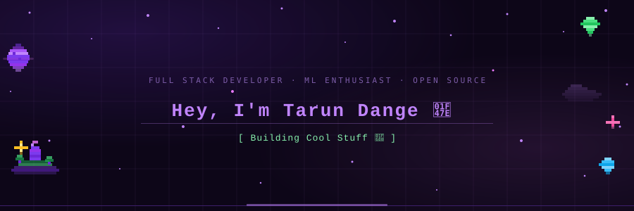

<div align="center">



<br/>

[](https://git.io/typing-svg)

<br/>

</div>

---
## 🛠️ Tech Stack

<div>

**Languages**
<br/>
[](https://skillicons.dev)

**Frameworks & Libraries**
<br/>
[](https://skillicons.dev)

**AI / ML**
<br/>
[](https://skillicons.dev)


----
### Tools & DevOps
<br/>
[](https://skillicons.dev)
<br/>

[](https://skillicons.dev)

</div>

---

# 👨‍💻 Tarun Dange

```python
class TarunDange:

    def __init__(self):
        self.username       = "HeadTarun"
        self.role           = [
                                "Full Stack Developer",
                                "AI/ML Engineer",
                                "Open Source Contributor"
                              ]

        self.current_focus  = [
                                "LLMs & RAG Pipelines",
                                "System Design",
                                "Cloud-Native Applications",
                                "AI Powered Products"
                              ]

        self.tech_stack     = {
                                "backend":  ["FastAPI", "Node.js", "Flask"],
                                "frontend": ["React", "Next.js", "TailwindCSS"],
                                "ai_ml":    ["PyTorch", "TensorFlow", "Scikit-Learn"],
                                "cloud":    ["Azure", "Docker", "Supabase"],
                                "database": ["PostgreSQL", "MongoDB", "Redis"]
                              }

        self.philosophy     = "Build fast. Scale smart. Learn endlessly."
        self.fun_fact       = "Turning bugs into undocumented features since day one 😤"
